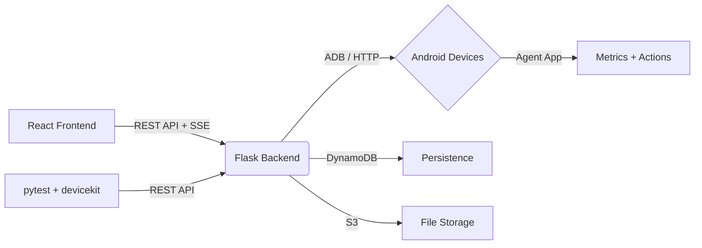

# DeviceKit

[](https://opensource.org/licenses/MIT)
[](https://www.python.org/downloads/)
[](https://reactjs.org/)
[](https://www.docker.com/)

<!-- Add a hero screenshot/GIF of the dashboard here -->
<!--  -->

A unified Android device management and test automation platform. Control a fleet of devices from a single dashboard — run automations, stream screens in real time, catch visual regressions, and debug failures with AI-powered analysis.

---

## Why DeviceKit?

Managing Android devices for testing usually means juggling ADB commands across terminals, manually tracking which device is running what, and digging through logs when something breaks. DeviceKit takes a different approach: a single platform that discovers your devices, lets you control them from a web dashboard, and automates the tedious parts.

The entire platform is **four components working together**. A Python/Flask backend manages device state and orchestrates actions. A React frontend provides the dashboard and visual editors. A Kotlin agent app runs on each Android device to report metrics and accept commands. And a Python library (`pip install devicekit`) gives you programmatic access for scripts and CI pipelines.

You get **AI-powered automation** out of the box. Describe what you want in plain English, and DeviceKit generates executable automation steps. When UI elements move between app versions, self-healing retries find the new location automatically. When tests fail, debug bundles package screenshots, logs, UI hierarchy, and device state into a single download — with optional AI root-cause analysis.

Under the hood, the platform provides **real-time streaming** (MJPEG video, not screenshot polling), **fleet-wide queries** (SQL-like filtering across all devices), **visual regression testing** (pixel diff + AI analysis), and a full **CI/CD integration** with a pytest plugin for parallel test execution.

---

## Table of Contents

- [Quick Start](#quick-start)
- [Capabilities](#capabilities)
- [Architecture](#architecture)
- [Documentation](#documentation)
- [Environment Variables](#environment-variables)
- [API Endpoints](#api-endpoints)
- [Frontend Views](#frontend-views)
- [Compatibility](#compatibility)
- [Troubleshooting](#troubleshooting)
- [Contributing](#contributing)
- [License](#license)

---

## Quick Start

### Docker (Recommended)

```bash
# 1. Clone and configure
git clone https://github.com/jhd3197/DeviceKit.git
cd DeviceKit
cp .env.example .env

# 2. Start everything
docker-compose up

# Frontend: http://localhost:3847
# API:      http://localhost:5890
# DynamoDB: http://localhost:8321
```

**That's it!** Connect an Android device via USB and it appears in the dashboard automatically.

### Manual Setup

```bash
# Backend
cd backend
pip install -r requirements.txt
python app.py
# API runs on http://localhost:5050

# Frontend
cd frontend
npm install
npm run dev
# Dev server on http://localhost:5173
```

### Connect a Device

```bash
# USB: just plug in the device (ADB must be enabled)
# WiFi: install the agent APK, both must be on the same network
# The agent auto-discovers the backend and starts reporting
```

**Need the agent app?** The backend serves it at `GET /agent/apk` — or build from `agent-android/`.

---

## Capabilities

### Fleet Management

Monitor and control all your devices from one place:

- Real-time metrics per device — CPU, RAM, battery, temperature, storage
- Device groups with tags, color coding, and bulk actions
- Fleet health aggregation with distribution breakdown (healthy / warning / critical)
- Device comparison view — up to 4 devices with synchronized real-time charts
- Auto-onboarding notifications when new devices connect

### Fleet Query Language

Filter your fleet with SQL-like expressions:

```sql
android_version < 13 AND battery > 20 AND status = 'idle'
manufacturer LIKE 'Sam%' OR tags IN ('staging', 'qa')
```

- Field autocomplete in the dashboard query bar
- Saved queries and built-in presets (low battery, offline, outdated OS)
- Pipe query results into bulk actions — reboot, lock, install APK, run automations
- Export results as CSV

### Automation Engine

Build device automations visually or programmatically:

- **14 step types** — tap, swipe, type, press key, open/close app, push/pull files, wait, assert, screenshot, and more
- **Drag-and-drop editor** with step previews and live device context
- **Record automations** — tap and swipe on the device, get automation steps generated
- **Schedule automations** — run on intervals with pause/resume controls
- **Share automations** — clone, export as JSON, import from file

### AI-Powered Automation

Describe automations in plain English:

```
"Open Settings, go to Wi-Fi, connect to the 'TestNetwork' SSID,
verify the connection status shows Connected"
```

- **Generate** — AI creates executable steps from natural language descriptions
- **Refine** — modify individual steps with conversational instructions
- **Explain** — get a plain-English summary of what any automation does
- **Self-healing** — when UI elements move between app versions, AI re-locates targets and retries automatically

### Visual Regression Testing

Screenshot-based assertions for your automations:

- `screenshot_assert` step type compares against stored baselines
- SSIM pixel-diff engine with configurable thresholds
- AI-powered diff analysis distinguishes meaningful UI changes from noise
- Mask regions to exclude dynamic content (clocks, ads, timestamps)
- Per-device-model baselines with version tracking
- Regression reports with pass / fail / needs-review breakdown

### Live Device Streaming

Real-time video, not screenshot polling:

- MJPEG streaming proxy with adaptive quality (5 / 15 / 30 fps)
- Multi-viewer support with viewer count badges
- Touch overlay with ripple animations
- Session recording and frame-by-frame playback with event markers
- Latency indicator — green (<100ms), yellow (<300ms), red (>300ms)
- Auto-fallback to screenshot polling if stream unavailable

### Failure Debug Bundles

When something breaks, get everything in one package:

- Auto-generated on automation step failure or test failure
- Contains: screenshot, logcat (last 100 lines), device state, UI hierarchy XML, recent actions, device properties
- **AI analysis** — sends bundle to AI for root-cause hypothesis and suggested fixes
- **Shareable links** — time-limited tokens for sharing bundles with teammates
- Download as ZIP, 30-day retention policy

### CI/CD Integration

Use DeviceKit in your test pipelines:

```python
# pytest with the devicekit plugin
def test_login_flow(device):
    device.app.start("com.example.app")
    device.input.tap(540, 1200)
    device.input.type_text("user@test.com")
    screenshot = device.screen.capture()
    assert screenshot is not None
```

- `devicekit` pytest plugin with `device` and `device_pool` fixtures
- Auto-screenshot on test failure
- Build lifecycle tracking with per-test results
- Device locking for parallel test runners
- GitHub Actions workflow template included

### Remote ADB & File Explorer

Full device control from the browser:

- ADB shell with command history and presets
- File explorer with search, upload, and download
- Device properties, diagnostics, and logcat viewer

### Prompture AI Integration

Each device becomes a conversational AI agent:

- Multi-provider support — Claude, GPT-4, Groq, Ollama, Google
- Per-device model selection and conversation memory
- AI tool use — LLM directly calls device actions in autonomous chains
- Token and cost tracking per device

---

## Architecture

```
DeviceKit/
├── backend/            Python/Flask API (port 5050)
│   ├── app.py          Entrypoint
│   ├── config.py       Environment config
│   └── devicekit/      Core package
│       ├── client.py             Mixin composition (28 mixins)
│       ├── device_manager.py     Thread-safe device pool
│       └── mixins/               ADB, UIAutomator2, CDP, DynamoDB, S3,
│                                 Automation, Prompture, Fleet, Streaming,
│                                 VisualRegression, DebugBundle, and more
├── frontend/           React 18 + Vite + Tailwind CSS
│   └── src/
│       ├── App.jsx     Router + sidebar layout
│       ├── api.js      API client
│       └── views/      11 views (Dashboard, NodeDetail, Pipeline, etc.)
├── devicekit-py/       Python library (pip install devicekit)
│   ├── connection.py   USB (ADB) and WiFi connections
│   ├── device.py       Manager composition pattern
│   └── pytest_plugin   CI/CD test fixtures
├── agent-android/      Kotlin agent app
│   └── app/            BackgroundAgent service, HTTP server (port 9800),
│                       UDP discovery (port 9801), accessibility service
└── docker-compose.yml  Full stack deployment
```

### How It Works



1. **Android agent** runs on each device — serves an HTTP API on port 9800, reports metrics to the backend
2. **Flask backend** merges ADB-connected and agent-registered devices into a unified fleet
3. **React frontend** subscribes to SSE events for real-time updates, REST for everything else
4. **devicekit library** connects directly to devices for scripts and CI — USB via ADB port forwarding, WiFi via auto-discovery
5. **pytest plugin** allocates devices, runs tests, and reports results back to the dashboard

---

## Documentation

| Guide | Description |
| --- | --- |
| [CI/CD Setup](docs/ci-setup.md) | GitHub Actions integration, device fixtures, parallel testing |
| [Prompture Integration](prompture_integration.md) | AI agent architecture, tool registration, multi-provider config |
| [Roadmap](ROADMAP.md) | Full development history and upcoming phases |
| [Environment Variables](#environment-variables) | All configuration options |

---

## Environment Variables

| Variable | Default | Description |
|----------|---------|-------------|
| `API_PORT` | `5050` | Flask API port |
| `API_HOST` | `0.0.0.0` | Flask bind address |
| `API_KEY` | - | API key for endpoint authentication (disabled if unset) |
| `AGENT_TOKENS` | - | Comma-separated tokens for agent authentication |
| `AWS_ACCESS_KEY_ID` | - | AWS credentials for DynamoDB/S3 |
| `AWS_SECRET_ACCESS_KEY` | - | AWS credentials |
| `AWS_REGION` | `us-east-1` | AWS region |
| `DYNAMODB_TABLE_PREFIX` | `devicekit_` | Table name prefix |
| `DYNAMODB_ENDPOINT` | - | Local DynamoDB URL (e.g. `http://localhost:8321`) |
| `CORS_ORIGINS` | `*` | Allowed CORS origins |
| `DEVICE_IDS` | - | Comma-separated device serials |
| `LOG_LEVEL` | `INFO` | Logging level |
| `DEBUG_MODE` | `false` | Enable Flask debug mode |
| `PROMPTURE_DEFAULT_MODEL` | - | Default AI model for device agents |

---

## API Endpoints

### Core
- `GET /health` — Health check
- `GET /devices` — List connected devices
- `GET /devices/:id` — Device info + diagnostics

### Fleet
- `GET /fleet/query?q=<expr>` — Query devices with FQL
- `POST /fleet/query/bulk-action` — Bulk action on query results
- `GET /fleet/health` — Fleet health aggregation
- `GET /fleet/groups` — Device groups

### Device Control
- `POST /devices/:id/adb` — Execute ADB command
- `POST /devices/:id/reboot` — Reboot device
- `GET /devices/:id/screenshot` — Screenshot (PNG)
- `GET /devices/:id/stream` — MJPEG video stream
- `GET /devices/:id/diagnostics` — CPU, RAM, temp, uptime
- `POST /devices/:id/lock` / `unlock` — Device allocation

### Automations
- `GET /automations` — List automations
- `POST /automations` — Create automation
- `POST /automations/:id/run` — Run on device
- `POST /automations/generate` — AI generate from description
- `POST /automations/refine-step` — AI refine step
- `GET /automations/:id/explain` — AI explain

### Visual Regression
- `POST /automations/:id/baselines` — Capture baseline
- `POST /automations/:id/baselines/:id/compare` — Compare against baseline
- `GET /automations/runs/:id/regression-report` — Regression summary

### Debug Bundles
- `POST /devices/:id/debug-bundle` — Generate bundle
- `GET /debug-bundles/:id/download` — Download ZIP
- `POST /debug-bundles/:id/analyze` — AI analysis
- `POST /debug-bundles/:id/share` — Shareable link

### Pipeline / CI
- `POST /pipeline/builds` — Start build
- `POST /pipeline/builds/:id/tests` — Report test result
- `GET /pipeline/builds/:id/failures` — Failure analysis

### Streaming & Sessions
- `GET /devices/:id/stream` — Live MJPEG stream
- `POST /devices/:id/sessions/record` — Start recording
- `POST /devices/:id/sessions/stop` — Stop recording

### Events
- `GET /events/stream` — SSE event stream (real-time updates)

---

## Frontend Views

| View | Route | Description |
|------|-------|-------------|
| Dashboard | `/` | Fleet overview, health cards, FQL query bar, device registry |
| Node Detail | `/node/:id` | Live stream, diagnostics, ADB shell, AI chat, sessions |
| Pipeline | `/pipeline` | Build list, test results, failure screenshots |
| Remote ADB | `/remote-adb` | Terminal, file explorer, command presets |
| Automations | `/automations` | Create, edit, run, schedule, share automations |
| Automation Editor | `/automations/new` | Visual step builder with AI generation |
| Automation Run | `/automations/runs/:id` | Live progress, step results, debug bundles |
| Device Groups | `/fleet/groups` | Group management, bulk actions |
| Device Compare | `/fleet/compare` | Side-by-side real-time device charts |
| Profiles | `/profiles` | Device AI personalities and model config |
| Settings | `/settings` | Platform configuration |

---

## Compatibility

| Component | Requirements |
| --- | --- |
| **Backend** | Python 3.11+ |
| **Frontend** | Node 18+, any modern browser |
| **Android Devices** | Android 7+ (API 24+), USB debugging enabled |
| **Agent App** | Android 8+ (API 26+) for full feature set |
| **Docker** | Docker 20+, docker-compose v2 |
| **OS** | Windows, macOS, Linux |

---

## Troubleshooting

### Device not appearing?

- Verify USB debugging is enabled on the device
- Run `adb devices` to confirm ADB sees it
- Check that `adb` is in your PATH

### Agent shows "Connecting..." forever?

- The agent can't reach the backend at `http://127.0.0.1:5050`
- For USB: run `adb reverse tcp:5050 tcp:5050` to forward the port
- For WiFi: set the backend URL in agent settings to your machine's IP

### Stream not loading?

- The agent app must be running on the device
- Check that port 9800 is accessible (`adb forward tcp:9800 tcp:9800` for USB)
- Try switching to a lower quality preset

### Docker issues?

- Run `docker-compose logs` to check for errors
- Ensure ports 3847, 5890, 8321 are not in use
- Check `.env` has valid AWS credentials (or use DynamoDB Local)

---

## Contributing

Contributions welcome! Here's how:

1. **Report bugs** — [GitHub Issues](https://github.com/jhd3197/DeviceKit/issues)
2. **Request features** — [GitHub Discussions](https://github.com/jhd3197/DeviceKit/discussions)
3. **Submit PRs** — Bug fixes, new step types, frontend improvements
4. **Improve docs** — All `.md` files in the repo

---

## License

This project is licensed under the **MIT License**.
See the [LICENSE](LICENSE) file for full details.

**Android** is a trademark of Google LLC. This project is **not affiliated with, endorsed by, or sponsored by Google LLC.**

---

## Get Help

- **Issues** — [GitHub Issues](https://github.com/jhd3197/DeviceKit/issues)
- **Discussions** — [GitHub Discussions](https://github.com/jhd3197/DeviceKit/discussions)
- **Docs** — Guides in the repository (see [Documentation](#documentation) table above)

> [!TIP]
> Starring this repo helps more developers discover DeviceKit!

---

**Made with care by [Juan Denis](https://github.com/jhd3197)**
